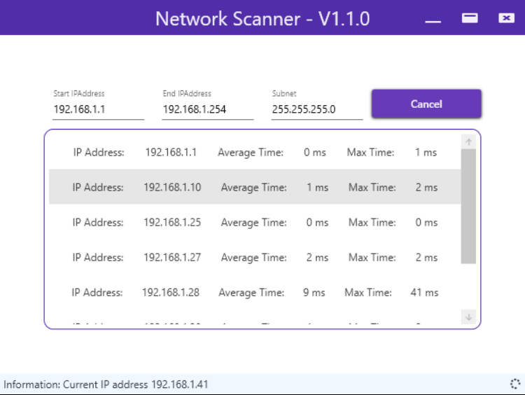

# NetworkScanner

# Summary
WPF application providing a UI for scanning networks using ICMP.

# Getting Started
There are two ways you can get the application.
* Download the application from the release section, unzip and run the NetworkScanner.exe
* Download the Visual Studio project source code and build it yourself.

# Versions
## V1.0.0 Supports
* Features
    * Automatic network settings recognition.
    * Async network scanning.
    * Detects users on a network that support ICMP.
    * Lists all active network users and their average ICMP response time.
## V1.1.0 Supports
* Features
    * Max response time.
    * Cancel scanning
